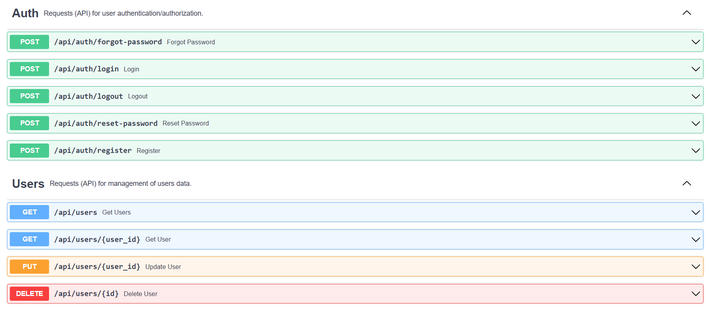
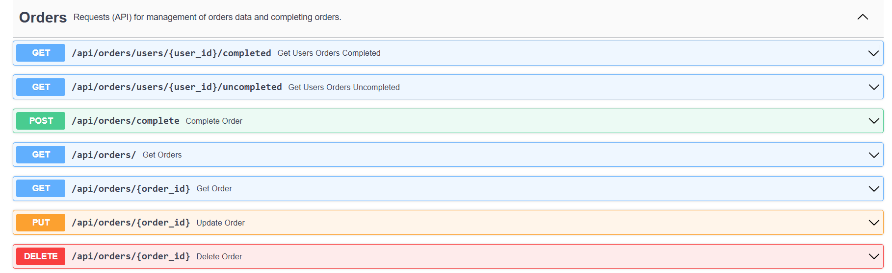
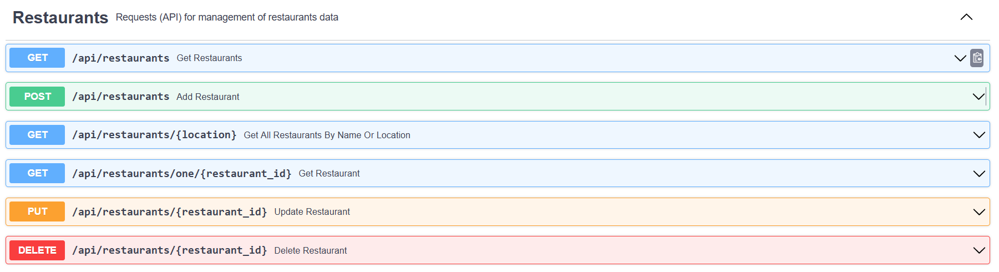
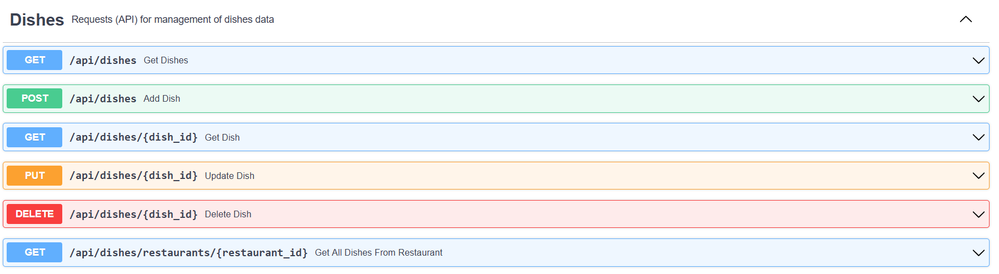

# twojejedzenie.pl - Food delivery app via Internet

Project from subjects:  Python Programming Practice (Praktyka Programowania Python), Web Application Design (Projektowanie Aplikacji Internetowych), Open Source Project Organization and Development (Organizacja i Rozwój Projektów Open Source)

Author: Sebastian **RICHTER**

Silesian University of Technology

Faculty of Automatic Control, Electronics and Computer Science

Informatics, 2nd semester

specialization: System Software

## Instruction of launching the app

**Showing a map from OpenStreetMap**

In order to display properly the map on the homepage, follow these steps:

1. Create an account on the site https://www.maptiler.com/
2. After the registration go to page https://cloud.maptiler.com/maps/.
There go to API keys section and copy generated key (next to the key there should be a description "Default key").
3. In location ordereatfront/src/components/maps create a file mapkey.js and type there the following source code.

```js
const MAP_KEY = <YOUR_API_KEY>;

export default MAP_KEY;
```

**Launching the app**

1. Install Docker with Docker Desktop tool.
2. Go to backend folder, open the command line and type a command docker-compose up to launch backend.
3. Go to ordereatfront folder, open the command line and type a command docker-compose up to launch frontend. In case of problems, type in the command line npm install.
4. After launching frontend and backend, open the web browser and type an address https://localhost:3000.

## Application working principle for different users

- **Not logged-in user**

1. User can search for restaurants in or near the location user provides. On the homepage, the user specifies the location in the search engine, then a list of the 10 results closest to his query is shown. The user selects one of them and then presses the "Find restaurants" button to see a list of restaurants near the selected location.
2. The user selects one of the restaurants from the obtained list and goes to the view with the most important information about the venue (location, delivery cost, delivery waiting time, minimum order amount for dishes to place an order from the selected restaurant) and a list of dishes offered by it. You can go to the details of a given dish (such as: name, price, category, description) by clicking on its name, or add it to the basket by clicking on the "Add to basket" button. In the basket you can change the number of ordered dishes until you go to the order summary. To proceed to placing an order, you must have an account on the site, be logged in and have a non-empty basket of dishes.
3. On the page with the list of dishes for a particular restaurant, user can search for dishes by name.
4. Non-logged users can also check the content of the basket on a dedicated page.
5. User can create an account on the service. He has to remember that his e-mail address has to resemble syntactically an e-mail address (including the @ character) and that his password has to have at least 8 characters and contain at least 1 lowercase and uppercase letter, 1 digit and 1 special character.
6. User can log in to the portal and change his password (change his password is also possible when user are logged in).

- **Logged-in user**

1. Logged-in user can order dishes. As part of the order, he must order dishes from a specific restaurant. If the user has finished completing the shopping cart, he can go to the order summary view, where he specifies the delivery address and payment method (payment card, BLIK, voucher).

   a) If the order is placed correctly, a message about the correct placing of the order will be displayed. If not, he will see a message about incorrect placing an order.

   b) If the total amount for dishes is greater than or equal to the minimum order amount for a given restaurant (excluding delivery costs) that user have to pay to receive free delivery, he will not have to pay for the delivery - otherwise user will pay for the delivery as much as the restaurant wants.

2. The logged-in user has access to the user panel (go through the human icon in the header of the page), where he can check his personal data, edit them, delete his account, change his password or go to the page with a list of completed and uncompleted orders placed by him.
3. Ability to log out of the portal.
4. Ability to use the options available to the non-logged user except for registration and login.

- **Administrator**

1. After logging into the site as an administrator, an additional button "Admin Panel" will appear in the page header. After clicking on it, user with this grant will see an administration panel where he can manage users, restaurants, dishes and orders (add (except orders), edit, display and delete). If, for example, there is an error in the order, it is possible to make a correction.
2. Ability to use all functionalities of the system.

## API used in project

API documentation created using FastAPI platform with description of necessary parameters and HTTP codes returned after running the backend project is available
at http://localhost:5000/docs.






## Technologies

- frontend: React.js 18.2.0,
- npm package manager in version 9.3.1,
- backend: Python 3.11, Flask 2.2.2, FastAPI 0.89.1, SQLAlchemy 2.0.0
  (list of all used Python libraries is available in a file requirements.txt in backend
  folder),
- database: PostgreSQL 11 with pgAdmin 4,
- project containerization: Docker 20.10.21 with Docker Desktop 4.15.0,
- API testing: SwaggerUI/Postman 10.9.0,
- IDE: Visual Studio Code 1.74.3,
- Git version control system,
- recommended web browsers: 
   - Microsoft Edge 109.0.1518.70,
   - Mozilla Firefox 109.0.

## License

Licensed under the [MIT License](LICENSE)
